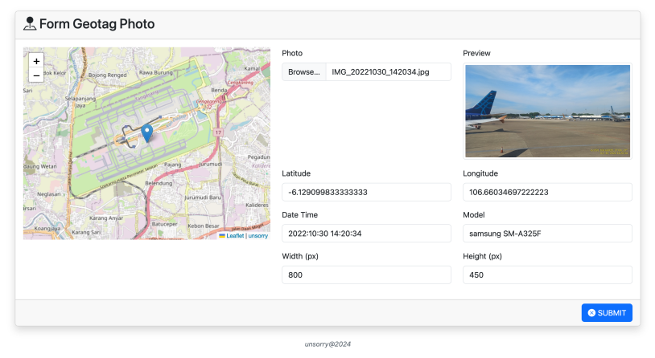

# HTML FORM GEOTAG PHOTO
This repository contains an example of an HTML form that can extract EXIF information from uploaded geotagged photos and display the location of the photo on a map.

## Library
- [Bootstrap](https://getbootstrap.com/)
- [Exif.js](https://github.com/exif-js/exif-js)
- [jQuery](https://jquery.com/)
- [Leaflet](https://leafletjs.com/)

## Preview

## Demo
[https://anshori.github.io/html-form-geotag-photo](https://anshori.github.io/html-form-geotag-photo)

___
> [unsorry@2024](https://unsorry.net)